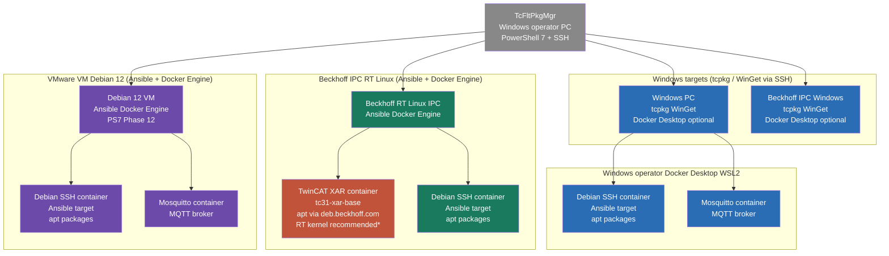

# TcFltPkgMgr

A PowerShell 7 fleet management tool for mixed industrial automation environments.
Manages packages, users, services, and containers across Windows (TwinCAT/tcpkg and WinGet),
Linux (Ansible), and Docker container targets from a single operator interface.

| Target type | Package manager | How it runs |
|-------------|----------------|-------------|
| Windows / TwinCAT | `tcpkg` | SSH → remote `TcPkg.exe` |
| Windows / general | `winget` | SSH → remote `winget` |
| Linux | Ansible (`apt`, `yum`, `dnf`, …) | `docker exec tcflt-ansible ansible-playbook` |
| Docker container | `apt`, `apk`, `yum`, `dnf` | SSH → `docker exec -i <container>` |

> **Status:** Under active development. Many features are still being tested. Use with care in production environments.

---

## Fleet topology

TcFltPkgMgr manages four categories of target from a single Windows operator machine.
The diagram shows what runs on each target type and how TcFltPkgMgr reaches it.



> \* TwinCAT XAR on a standard Linux kernel (Debian VM or Docker Desktop/WSL2) is
> untested. The RT kernel is required for real-time performance; whether the
> container starts at all without it is unverified. See Phase 11 testing checklist.

**Target types and management paths:**

| Target | OS | Reached via | Package management |
|--------|----|-------------|-------------------|
| Windows PC | Windows | SSH | tcpkg, WinGet, or both |
| Beckhoff IPC (Windows) | Windows | SSH | tcpkg, WinGet, or both |
| Beckhoff IPC (RT Linux) | Beckhoff RT Linux | SSH | Ansible (apt) |
| VMware Debian VM | Debian 12 | SSH | Ansible (apt) |
| Docker container (Debian SSH) | Linux | SSH to host + docker exec | apt via Ansible |
| Docker container (Mosquitto) | Linux | SSH to host + docker exec | n/a |
| Docker container (TwinCAT XAR) | Beckhoff RT Linux | SSH to IPC + docker exec | apt via deb.beckhoff.com |

A Beckhoff IPC running Windows is managed identically to a Windows PC.
The VMware Debian VM is the closest substitute for a Beckhoff RT Linux IPC
for Ansible and Docker testing without physical hardware.

---

## Requirements

### All targets
- PowerShell 7 (PS7) — required for parallel SSH execution
- [Posh-SSH](https://github.com/darkoperator/Posh-SSH) PowerShell module (`Install-Module Posh-SSH`)
- SSH enabled on each remote target
- Administrator privileges on the local machine

### Windows / tcpkg targets
- TwinCAT Package Manager (`tcpkg`) installed on the local machine
- `tcpkg` installed on each remote target at `C:\ProgramData\Beckhoff\TcPkg\TcPkg.exe` (configurable)

### Windows / WinGet targets
- `winget` (App Installer) installed on each remote target
- Use **Setup → select target → 4. Prepare target** to install WinGet on a remote machine

### Linux targets (Ansible)
- Docker Desktop running on the operator machine
- `tcflt-ansible` container built and running (see [Building the Ansible operator container](#building-the-ansible-operator-container))
- Python 3 and SSH on each Linux target

### Docker container targets
- SSH access to the Docker host machine
- Docker CLI available on the Docker host

---

## Launching the Program

```powershell
.\TcFltPkgMgr.ps1 -AsAdmin -Live
```

| Switch | Description |
|--------|-------------|
| `-AsAdmin` | Re-launches the script with administrator privileges (required for tcpkg to write its config) |
| `-Live` | Turns off Read-Only mode so commands actually execute. Without this, commands are shown but not run. |

You can also toggle Read-Only mode from inside the program via **Setup > 9. Read-only mode**.

---

## First-Time Setup

### 1. Generate local config files

From the main menu, go to **7. Setup**, then select **5. Generate local config files**.

This creates two files in the `config/` folder that you can edit without affecting the defaults:

- `feeds.local.json` — add custom or authenticated Beckhoff feeds
- `settings.local.json` — override SSH timeouts, logging, tcpkg paths, and UI behaviour

These files are gitignored and will not be overwritten by updates.

### 2. Configure your package feeds

Go to **Setup > 4. Manage feeds / sources**.

The dashboard shows all feeds currently configured in tcpkg on the local machine. To add a Beckhoff preset feed (Stable, Outdated, Testing, Preview):

1. Choose **1. Add Beckhoff preset**
2. Select the feed from the numbered list
3. Enter your Beckhoff account username
4. `tcpkg` will prompt for your password and the feed disclaimer — respond directly in the console

> Feed credentials are stored encrypted by tcpkg; they are never written to disk in plain text by this tool.

To toggle a feed on or off, enter its row number (11, 12, etc.) at the **Choice:** prompt.

### 3. Add remote targets

Go to **Setup > 1. Add remote target**.

For each remote TwinCAT PC you want to manage, you will be prompted for:

| Field | Description |
|-------|-------------|
| Name | A friendly label (e.g. `PC-1`) |
| Address | IP address or hostname |
| Port | SSH port (default: 22) |
| User | SSH username |
| Password | SSH password (stored by tcpkg, not this tool) |
| Internet Access | Whether the remote machine can reach Beckhoff's feed servers directly |

**Internet Access** is the key routing decision:

- **Yes** — the remote machine downloads packages from its own configured feeds via SSH. Faster and more scalable.
- **No** — the local machine resolves packages and pushes them to the remote via `tcpkg -r`. Use this for air-gapped machines or machines missing a required feed.

> If a machine has Internet Access = Yes but is missing the required feed, TcFltPkgMgr will automatically switch it to push-from-local for that operation and restore it afterwards.

### 4. Import targets from CSV (optional)

If you have many targets, you can define them in a CSV file and import them via **Setup > 2. Import targets from CSV**.

The CSV must have these columns:

```
Name,Address,Port,User,InternetAccess,Password
PC-1,192.168.100.101,22,Administrator,True,
PC-2,192.168.100.102,22,Administrator,True,
```

Passwords are not stored in the CSV (the column should be empty). You will be prompted for a shared SSH password during import. You can also export your current targets to a CSV via **Setup > 3. Export targets to CSV**.

---

## Installing a Package

From the main menu, select **1. Fleet Install**.

1. Enter a partial package name to search (e.g. `opc`)
2. Select the feed to search, or choose **All feeds**
3. Pick a package from the results list
4. Pick a version, or choose **Latest**
5. The fleet dashboard appears — select which targets to install on (by number, comma-separated, or range e.g. `11-15`)
6. Enter SSH credentials if prompted
7. Confirm and watch the batch dashboard as installs run in parallel

Targets with Internet Access = Yes install via parallel SSH. Targets missing the required feed automatically switch to push-from-local and are restored after the operation.

Use `-` and `+` on the numeric keypad to page through the target list when the fleet exceeds the page size (default 20, configurable via **7. UI Config**).

Both the Fleet and Setup dashboards show `OS` (`Win`/`Lnx`/`Mac`) and `Type` (`Phys`/`VM`/`Cntr`) columns for every target. Row colours indicate target type: Linux/macOS rows appear in cyan, container rows in magenta, and Windows rows use green/red/grey for online/offline/checking. The `Internet` column shows `---` for Linux and container targets — they manage their own internet access and do not use the push-from-local path.

Press `*` to sort by any column — Name, Address, Port, Internet Access, or Status. The sort order is saved to `targets.local.json` immediately so it persists across restarts. Press `*` again on the same column to toggle ascending/descending.

Press `/` to filter the target list by any column value. Active filters show in the dashboard: `[Filter: Reachable = 'online']  7 → 4 targets`. Press `/` then `0` to clear. Sort and filter state is shared between Fleet and Setup — both screens always show targets in the same order.

---

## Other Operations

| Menu | Description |
|------|-------------|
| **2. Fleet Upgrade** | Upgrade a package across selected targets |
| **3. Fleet Uninstall** | Uninstall a package across selected targets |
| **4. Package Status** | Check installed version of a package across all targets at once |
| **5. Outdated Check** | List all packages with newer versions available across the fleet |
| **7. UI Config** | Page size, display backend, and other display preferences |
| **8. Setup** | Add/remove targets, manage feeds, import/export config, view command log |

---

## Credential Storage

Passwords (SSH credentials, feed passwords) are stored encrypted on disk — never in plain text and never committed to the repository.

| Platform | Backend | Store location |
|----------|---------|---------------|
| Windows | Windows DPAPI (`ProtectedData`) | `config/credentials.win.json` |
| Linux / macOS | AES-256, random machine key | `config/credentials.local.enc` |

On Windows, credentials can only be decrypted by the same user account that saved them. On Linux, a cryptographically random 256-bit key is generated on first use and stored in `config/credentials.key`. Security is provided by filesystem permissions on the config directory — restrict with `chmod 700 ~/.config/tcfltpkgmgr` on Linux.

When Ansible support is added (Phase 5), Ansible Vault passwords will also be stored here, providing a two-tier model: the TcFltPkgMgr credential store protects the vault password, and Ansible Vault protects playbook secrets.

All credential files are listed in `.gitignore` and will never be committed.

---

## Cross-platform Support

TcFltPkgMgr runs on Windows, Linux, and macOS. The operator machine (where the tool runs) can be any platform — it manages remote Windows TwinCAT targets via SSH regardless of local OS.

| Feature | Windows operator | Linux / macOS operator |
|---------|-----------------|----------------------|
| Fleet dashboard | ✅ | ✅ |
| SSH installs on remote targets | ✅ | ✅ |
| Ansible (Linux targets) | ✅ | ✅ |
| Docker container management | ✅ | ✅ |
| tcpkg push-from-local | ✅ | ❌ requires local tcpkg |
| Feed management (add/remove) | ✅ | ❌ requires local tcpkg |
| Credential storage | DPAPI encrypted file | AES-256 encrypted file |

On Linux, menu options that require a local tcpkg installation are shown with a `[Windows only]` label. All SSH-based operations (remote installs, Ansible, Docker exec) work identically on all platforms.

The tool detects the operating system at startup and gates features accordingly via `Test-FltFeatureAvailable`.

**Reachability caching:** The fleet dashboard checks TCP port 22 on each target to determine online/offline status. Targets confirmed online are cached for 60 seconds (configurable via `ui.reachCacheSecs`) so navigating between menus doesn't re-check targets unnecessarily. Offline targets are always re-checked. The current page of targets is checked first on startup, with remaining pages queued as a background job.

---

## Built-in Tests

Run **Setup → 10** to open the test runner dashboard, which shows all diagnostic and integration test suites with last-run results and timestamps.

```
  #     Suite                                 Tests  Last run          Result
  ── Diagnostics ───────────────────────────────────────────────────────
  1     All diagnostic tests                  29     2026-06-16        29/29 ✓
  ── Integration ───────────────────────────────────────────────────────
  11    File I/O                              ?      never             —
  12    Pagination and target selection       ?      never             —
  13    SSH connectivity  [needs target]      ?      never             —
  14    Read-only mode                        ?      never             —
  15    Log system                            ?      never             —
  16    Reachability cache                    ?      never             —
  ── Targets for integration tests (21+ to toggle) ─────────────────────
  21  ● PC-1   192.168.8.101
  22    PC-2   192.168.8.102
```

**Input (numpad-only):** `1` all diagnostics · `9` all integration · `11`–`16` specific suite · `21+` toggle targets (supports `21,23` or `21-24` or `21..24`) · `0` back.

**Diagnostics** (29 checks) run offline — no network, SSH, or tcpkg calls. They verify adapter wiring, credential round-trips, config loading, sort/filter logic, and target store serialization.

**Integration suites** test real infrastructure: file I/O, pagination, SSH connectivity, read-only mode, log system, and reachability cache. Suite 13 (SSH) requires at least one target toggled on with `21+`. Results are saved to `config/test-results.json` and shown as last-run history on the dashboard.

---

All `tcpkg` commands run by this tool are logged to `logs/commands.ndjson` (newline-delimited JSON). Each entry includes timestamp, session ID, target, command, exit code, and duration.

Batch operations (install/upgrade/uninstall) are logged as a single `batch` event with per-target results.

To view recent log entries from inside the tool: **Setup > 8. View command log**.

---

## WinGet integration

Targets with `PackageManager = winget` (set via **Setup > Add/Edit target**) use `winget` instead of `tcpkg` for install, upgrade, and uninstall operations. The operator machine does not need winget installed — winget runs on the remote target via SSH.

**Routing:** `FleetExecutor` splits targets into three buckets per operation:

| Bucket | Condition | Executor |
|--------|-----------|----------|
| tcpkg SSH | Internet Access = Yes, PackageManager = tcpkg or both | `Invoke-FltSshBatch` |
| WinGet SSH | Internet Access = Yes, PackageManager = winget or both | `Invoke-FltWinGetBatch` |
| Push | Internet Access = No | tcpkg local push |

Setting `PackageManager = both` routes a target into both SSH buckets — useful for targets that have both TwinCAT and general Windows packages.

**Operator machine winget** (optional): install winget locally to enable package search and version browsing via `Search-FltWinGetPackage`. Without it, install by id still works by typing the package id directly.

**Exit codes:** WinGet's numeric exit codes are mapped to readable status: `0` = OK, `-1978335212` = not found, `-1978335189` = already installed, `-1978335188` = no upgrade available.

**Package manager routing function:** `Get-FltEffectivePackageManager` resolves a target's package manager, defaulting to `tcpkg` for Windows targets with no explicit setting.

---

## Configuration

### `settings.default.json` sections

| Section | Key settings |
|---------|-------------|
| `ssh` | `timeoutSeconds` (1800), `throttleLimit` (25), `jitterMaxMs`, `retryCount` |
| `winget` | `remoteWinGetPath` ("winget"), `timeoutSeconds` (300) |
| `ansible` | `executablePath` ("ansible-playbook"), `useWsl` (false), `wslDistro`, `tempDir`, `forks` (10) |
| `tcpkg` | `executablePath`, `remoteTcpkgPath` |
| `docker` | `throttleLimit` (20), `logTailLines` (50) |
| `ui` | `dashboardPageSize` (20), `reachCacheSecs` (60), `displayBackend` |
| `log` | `retentionDays` (30), `captureFleet` |

Override any setting in `config/settings.local.json` (gitignored).

---

## WinGet package management

From the Fleet home screen press **2. WinGet** to access the WinGet sub-menu:

- **1. Install** — search winget, pick package and version, select targets, install in parallel via SSH
- **2. Upgrade** — search, pick, select targets, upgrade in parallel
- **3. Uninstall** — select a reference target, query what's installed via `winget list`, pick a package, select all targets to uninstall from
- **4. Status** — show installed/not-installed for a given package id across all winget targets

Microsoft Store apps (`msstore` source) are automatically excluded from Install and Upgrade — they require an interactive Microsoft account session and cannot be installed via SSH.

---

## Docker prerequisites

Docker Desktop must be installed on the operator machine for:
- Managing containers on remote Linux targets (DCC-4, DCC-5) via SSH
- Running the Ansible operator container (`tcflt-ansible`)
- Managing Windows containers (future)

Install Docker Desktop from https://www.docker.com/products/docker-desktop/

TcFltPkgMgr detects Docker status automatically:

| Status | Meaning |
|--------|---------|
| `running` | Docker daemon is ready — all Docker operations available |
| `starting` | Docker Desktop is open but daemon still initialising |
| `stopped` | Docker Desktop installed but not running — TcFltPkgMgr can start it |
| `not-installed` | Docker Desktop not found |

Run **Suite 22** in the test runner to check Docker status. TcFltPkgMgr will offer to start Docker Desktop from Setup when needed (Phase 7).

---

## Docker Desktop (operator machine)

Docker Desktop must be installed and running on the operator machine for:
- The Ansible operator container (`tcflt-ansible`)
- Managing Docker containers on remote targets (Phase 7)
- Windows containers (future)

TcFltPkgMgr can start Docker Desktop automatically if it is installed but not running — this is available from **Setup → Prepare** (Phase 7 UI).

| Status | Meaning |
|--------|---------|
| `running` | Daemon ready — all Docker operations available |
| `starting` | Docker Desktop launched, daemon still initialising |
| `stopped` | Docker Desktop installed but not running — TcFltPkgMgr can start it |
| `not-installed` | Docker Desktop not found — install from https://www.docker.com/products/docker-desktop/ |

Run **Setup → 10. Diagnostics → Suite 22** to check Docker status.

---

## Docker Desktop (operator machine)

TcFltPkgMgr uses Docker on the operator machine for two purposes:
- **Ansible operator container** (`tcflt-ansible`) — provides Ansible without WSL
- **Windows containers** — managing Windows container workloads (Phase 7)

Docker Desktop is detected automatically. Status is shown in **Setup → Diagnostics → Suite 22**.

| Status | Meaning |
|--------|---------|
| `running` | Daemon ready — all Docker features available |
| `starting` | Docker Desktop launched, daemon initialising |
| `stopped` | Docker Desktop installed but not running — TcFltPkgMgr can start it from Setup |
| `not-installed` | Docker Desktop not installed |

TcFltPkgMgr can launch Docker Desktop automatically when needed (via `Start-FltDockerDesktop`). Docker Desktop is detected at its standard path (`C:\Program Files\Docker\Docker\Docker Desktop.exe`) or via the Windows App Paths registry key.

---

## Ansible prerequisites

Ansible runs in a Docker container on the operator Windows machine — no WSL or separate Linux machine needed. The container (`tcflt-ansible`) is built from `docker/Dockerfile.ansible` included in this project.

### Quick start

```powershell
# 1. Build the Ansible operator container (once)
docker build -f docker/Dockerfile.ansible -t tcflt-ansible .

# 2. Start the container (persists across reboots)
docker run -d --name tcflt-ansible --restart unless-stopped `
  -v ${PWD}/ansible:/ansible `
  tcflt-ansible

# 3. Install the SSH public key on every Linux fleet target
#    The key is exported to ansible/tcflt-ansible.pub at container startup
cat ansible/tcflt-ansible.pub  # view the key
ssh-copy-id -i ansible/tcflt-ansible.pub Administrator@192.168.x.x

# 4. Verify in TcFltPkgMgr — Setup → 10. Diagnostics → Suite 21
```

> **SSH key pair:** An ed25519 key pair is generated at **build time** and baked
> into the image. On first startup the public key is written to
> `ansible/tcflt-ansible.pub` (the bind-mount). The private key never leaves
> the container. **After any image rebuild, re-install the new public key on all
> Linux targets** — the key changes with every build.

### Detection modes (in priority order)

| Mode | Detection | How invoked |
|------|-----------|-------------|
| `native` | `ansible-playbook` on PATH | `ansible-playbook` |
| `wsl` | `wsl ansible-playbook --version` exits 0 | `wsl [-d <distro>] ansible-playbook` |
| `docker` | `docker exec tcflt-ansible ansible-playbook --version` exits 0 | `docker exec tcflt-ansible ansible-playbook` |
| *(none)* | None of the above | Suite 21 passes with Available=false |

The container name defaults to `tcflt-ansible` and can be overridden via `ansible.dockerContainer` in `settings.local.json`. The `community.docker`, `community.general`, and `ansible.posix` collections are pre-installed in the container.

---

## Ansible inventory (Phase 5.2)

`New-FltAnsibleInventory` generates an INI-format Ansible inventory from the fleet target list. It is called automatically before each Ansible run and cleaned up afterward via `Remove-FltAnsibleInventory`.

The file is written to `ansible/inventory/hosts.ini` (gitignored) and recreated fresh on every run.

### Inventory groups

| Group | Targets included |
|-------|-----------------|
| `[physical]` | `OS='linux'`, `TargetType='physical'` |
| `[vm]` | `OS='linux'`, `TargetType='vm'` |
| `[containers]` | `OS='linux'`, `TargetType='container'` |
| `[linux:children]` | Meta-group combining all of the above (written when more than one group exists) |

Non-Linux targets are silently skipped. If no Linux targets exist, the file is not written.

### Authentication

Inventory entries use SSH key authentication only — **passwords are never written to inventory files**.

- If `ssh.privateKeyPath` is set in settings and the file exists, `ansible_ssh_private_key_file` is added (path normalised to forward slashes for POSIX Ansible).
- Otherwise no auth var is written; Ansible uses its own key discovery at run time.

### Container targets

Linux container targets include `community.docker.docker_api` connection vars so the Ansible Docker connection plugin can reach them:

```ini
web-1 ansible_host=192.168.8.50 ansible_user=admin ansible_port=22 ansible_connection=community.docker.docker_api ansible_docker_host=tcp://192.168.8.50:2375
```

The Docker host address is resolved from the matching `DockerHost` target in the fleet. The daemon port defaults to 2375 and can be overridden with `docker.daemonPort` in `settings.local.json`.

---

## Ansible playbook builder (Phase 5.3)

Five private functions in `execution/AnsibleExecutor.ps1` generate YAML playbooks and write them to `ansible/playbooks/` (gitignored) before each Ansible run. Files are timestamped and cleaned up after the run.

| Function | Ansible module | Actions |
|----------|---------------|---------|
| `_Get-PackagePlaybook` | `ansible.builtin.package` | `install` · `upgrade` · `remove` |
| `_Get-ServicePlaybook` | `ansible.builtin.systemd` | `start` · `stop` · `restart` · `enable` · `disable` |
| `_Get-UserPlaybook` | `ansible.builtin.user` | `create` · `remove` |
| `_Get-FilePlaybook` | `ansible.builtin.copy` | copy a file from controller to targets |
| `_Get-DockerPlaybook` | `community.docker.docker_container` | `pull` · `start` · `stop` · `restart` · `recreate` · `remove` |

All playbooks use `become: true` (sudo escalation) and `gather_facts: false` for speed. Package operations use `ansible.builtin.package` which is distro-agnostic — the same playbook works on Debian, Ubuntu, and RPM-based targets. Docker container playbooks default to `hosts: containers`; all others default to `hosts: linux`.

---

## Ansible batch executor (Phase 5.4)

`Invoke-FltAnsibleBatch` in `execution/AnsibleExecutor.ps1` is the top-level entry point for running Ansible playbooks against the fleet. It follows the same contract as `Invoke-FltSshBatch` and `Invoke-FltWinGetBatch` — callers get `BatchResult[]` and an optional `$OnProgress` callback.

### Workflow

1. **Inventory** — calls `New-FltAnsibleInventory` to write `ansible/inventory/hosts.ini`
2. **Playbook** — evaluates the caller-supplied `$PlaybookBuilder` scriptblock (one of the `_Get-*Playbook` functions)
3. **Run** — executes `ansible-playbook -i <inv> <playbook> --one-line -o json --forks <n>` via the active Ansible mode (native / WSL / Docker)
4. **Parse** — `_Parse-AnsibleOutput` maps per-host lines to `BatchResult` entries
5. **Progress** — fires the `$OnProgress` callback with a status dictionary
6. **Cleanup** — removes both temp files
7. **Log** — writes a batch entry via `Write-FltBatchEntry` with `PackageManager = 'ansible'`

### Exit code mapping

| Exit code | Meaning |
|-----------|---------|
| 0 | All hosts OK |
| 2 | One or more hosts failed |
| 4 | One or more hosts unreachable |
| 6 | Failures and unreachable |
| 8 | Ansible config/parse error |

### Read-only mode

When `-ReadOnly $true` is passed, no inventory or playbook is written and no Ansible process is started. All targets return `Status = 'Skipped'` with `Note = 'Read-only mode'` — consistent with the other executors.

### forks

Parallelism is controlled by `ansible.forks` in `settings.default.json` (default 10). Override in `settings.local.json`.

---

## Fleet executor routing (Phase 5.5)

`Invoke-FleetAction` in `execution/FleetExecutor.ps1` now routes targets into four buckets:

| Bucket | Condition | Executor |
|--------|-----------|---------|
| Ansible | `OS='linux'` AND `TargetType != 'container'` | `Invoke-FltAnsibleBatch` |
| tcpkg SSH | Windows, `InternetAccess=$true`, PackageManager = `tcpkg`/`both` | `Invoke-FltSshBatch` |
| WinGet SSH | Windows, `InternetAccess=$true`, PackageManager = `winget`/`both` | `Invoke-FltWinGetBatch` |
| Push | Windows, `InternetAccess=$false` | tcpkg `-r` push |

Linux targets are separated first and never enter the Windows bucket logic. Targets that land in no bucket (e.g. Linux containers with no package manager assigned) receive an immediate `Status='Unsupported'` result — they are never silently dropped.

---

## Preparing targets for WinGet

Use **Setup → select target → 4. Prepare target** to install WinGet on a remote Windows machine via SSH. The installer:

1. Checks if WinGet is already installed — skips if present
2. Downloads the latest WinGet bundle and Windows App Runtime redistributable from GitHub (~230MB total)
3. Provisions WinGet system-wide via a SYSTEM-context scheduled task
4. Attempts to install the Windows App Runtime framework as the authenticating user
5. If the framework install is blocked (Windows Update disabled machines), schedules a one-time logon task to complete activation at next autologin
6. Reboots the target — autologin fires, the logon task runs, WinGet activates
7. Verifies `winget --version` in a fresh SSH session after reboot

**Requirements:** Internet access on the target, SSH running as the authenticating user (not SYSTEM).

**Windows Update disabled (TwinCAT engineering PCs):** The Windows App Runtime framework package cannot be installed via SSH — it requires an interactive desktop token. The installer handles this automatically by scheduling a logon task that runs during autologin, which provides the required token. The reboot that follows activates WinGet fully without any manual intervention.

**If the automated install fails** and the hard-wall error is shown, three options are available:

1. Enable Windows Update temporarily, run it once, disable it — the runtime installs via WU
2. RDP to the target and run the displayed PowerShell commands once interactively
3. Keep using `tcpkg` for this target (edit target, set `PackageManager = tcpkg`)

---

## Configuration Reference

`config/settings.local.json` overrides (create with **Setup > 5**):

```jsonc
{
  "ssh": {
    "timeoutSeconds": 1800,   // per-target SSH timeout
    "throttleLimit":  25      // max parallel SSH connections (keep ≤50 to avoid TCP pool exhaustion)
  },
  "docker": {
    "throttleLimit": 20,      // max parallel docker exec connections
    "logTailLines":  50       // lines shown by Container > View logs
  },
  "tcpkg": {
    "executablePath":  "tcpkg",                                       // local tcpkg command
    "remoteTcpkgPath": "C:\\ProgramData\\Beckhoff\\TcPkg\\TcPkg.exe"  // path on remote targets
  },
  "log": {
    "retentionDays": 30,      // days to keep log entries
    "captureOutput": false    // log full tcpkg output (verbose)
  }
}
```

`config/feeds.local.json` — add custom feeds:

```jsonc
{
  "beckhoff": {},
  "custom": {
    "MyInternalFeed": {
      "url":      "https://my-server/nuget/",
      "priority": 10,
      "username": "feeduser"
    }
  }
}
```

---

## Ansible Vault integration (Phase 5.6)

TcFltPkgMgr uses a two-tier credential model to keep secrets out of playbooks and inventory files:

| Tier | What it protects | How it is stored |
|------|-----------------|------------------|
| 1 | Ansible Vault password | TcFltPkgMgr credential store (DPAPI on Windows, AES-256 on Linux) |
| 2 | Playbook secrets (sudo passwords, API keys, service credentials) | Ansible Vault AES-256 encrypted files |

The operator enters the vault password once via **Linux Admin — Setup — Vault password**. TcFltPkgMgr passes it automatically to every `ansible-playbook` run via `--vault-password-file`.

### Vault password setup

```
TcFltPkgMgr > Linux Admin > Setup > Vault password
```

Or call directly: `Invoke-FltVaultSetup`

### Vault-encrypted variable files

Encrypted variable files live under `ansible/` and are safe to commit:

```
ansible/
├── group_vars/
│   └── all.yml.vault        # encrypted: sudo credentials, shared secrets
└── host_vars/
    └── <hostname>.yml.vault  # per-host secret overrides
```

To create a vault file: `ansible-vault create ansible/group_vars/all.yml.vault`

### Vault password rotation

```powershell
# 1. Re-key all vault files
ansible-vault rekey ansible/group_vars/all.yml.vault

# 2. Update the stored password
# TcFltPkgMgr > Linux Admin > Setup > Vault password
```

### How it works at run time

`_Get-VaultPasswordFile` retrieves the vault password from the credential store, writes it to a `*.tmp` file in the system temp directory (permissions restricted to the current user), and returns the path. `Invoke-FltAnsibleBatch` passes this as `--vault-password-file` to `ansible-playbook` and deletes the temp file immediately after the run. If no vault password is stored, the flag is omitted entirely — playbooks without encrypted vars work without it.

---

## Menu structure (Phase 6.1)

The fleet home screen footer now reads:

```
  1. tcpkg   2. WinGet   3. Linux Admin   4. Profiles   5. UI Config   6. Setup   0. Exit
```

Selecting **3. Linux Admin** opens the Linux Admin menu (Phase 6.2) which lists all
`OS='linux'`, non-container fleet targets and provides package, user, service, and
playbook operations via Ansible.

---

## Container executor (Phase 7)

Container fleet targets use a two-hop execution model: SSH to the Docker host, then `docker exec` into the container. This avoids requiring SSH inside containers.

### Execution functions

| Function | What it does | `PackageManager` field |
|----------|-------------|----------------------|
| `Invoke-FltDockerExecBatch` | Runs package commands inside containers via `docker exec -i <container> <pkgcmd>` | `docker-exec` |
| `Invoke-FltDockerLifecycleBatch` | Runs `docker pull/stop/start/restart/rm/run` on the Docker host | `docker-lifecycle` |
| `Test-FltDockerHostReachable` | SSHes to Docker host and runs `docker info`; returns `online`, `docker-down`, or `offline` | — |

### Package manager mapping

The `PackageManager` field on the container target controls which CLI is used inside the container:

| `PackageManager` | Install | Remove |
|-----------------|---------|--------|
| `apt` (default) | `apt-get install -y` | `apt-get remove -y` |
| `apk` | `apk add` | `apk del` |
| `yum` | `yum install -y` | `yum remove -y` |
| `dnf` | `dnf install -y` | `dnf remove -y` |

### Fleet routing

`Invoke-FleetAction` routes `TargetType='container'` targets to `Invoke-FltDockerExecBatch` for package operations. The Docker host address and container name are stored on the `FleetTarget` and resolved at run time.

---

## Adding container targets (Phase 7.4)

Container targets are added via **Setup → Add target → 3. Docker container**.

The flow prompts for:

1. **Docker host** — must be an existing physical or VM target in the fleet
2. **Container name** — the Docker container name (e.g. `web_app`)
3. **Package manager** — `apt` (default), `apk`, `yum`, or `dnf`

`Address`, `Port`, and `User` are inherited from the Docker host — no separate SSH entry is needed. The container appears in the fleet dashboard with `<host>/<container>` in the address column and `Cntr` in the type column.

Container targets route automatically to `Invoke-FltDockerExecBatch` for package operations and are excluded from the Windows tcpkg/winget/push buckets.

### Standalone model helpers (Phase 7.4)

Four new standalone wrapper functions were added to `classes/Models.ps1` following the PS7 class method convention (results must not be assigned from method calls):

| Function | Replaces |
|----------|----------|
| `Get-FltEffectiveAddress` | `$t.EffectiveAddress()` |
| `Get-FltIsContainer` | `$t.IsContainer()` |
| `Get-FltTypeDisplay` | `$t.TypeDisplay()` |
| `Get-FltOsDisplay` | `$t.OsDisplay()` |

---

## Batch dashboard pagination (Phase 7.0)

`Show-FleetBatchDashboard` now paginates when the target count exceeds the page size
(configured via `ui.dashboardPageSize`, default 20). This keeps the batch operation
display usable at container scale with 100+ targets.

### Behaviour

- Dashboard height is fixed to the page size — the layout never scrolls off screen
- The mode line shows `Page N/M  (- prev  + next)` when multiple pages exist
- The summary row always shows totals across **all** targets regardless of current page
- Auto-scrolls to the first non-OK row on the current page after each update

### Page navigation

Call `Move-FltBatchPage -Delta 1` (next) or `Move-FltBatchPage -Delta -1` (prev) from
the menu layer during a batch run. `Move-FltBatchPage` is a no-op when all targets fit
on a single page. The `-` and `+` keys are the intended triggers, consistent with
fleet dashboard navigation.

---

## Phase 8.0 pre-work

Three housekeeping items completed before building the Container Admin menu:

### `targetType` in command log

`Write-FltBatchEntry` now includes a `targetType` field per result row in the NDJSON log.
The value is resolved from `$Script:FleetTargets` by target name at log-write time,
so no changes to `BatchResult` class were required.

### Type column in batch dashboard

The batch operation dashboard now shows a `Type` column (`Phys` / `VM` / `Cntr`) between
the target name and status columns. The target name column was narrowed from 22 to 18
characters to accommodate. The column uses `Get-FltTypeDisplay` which is the same
standalone wrapper used in the fleet dashboard.

### Post-batch page navigation

`Read-FltBatchNav` replaces the plain `Read-Host` at the end of batch operations in
`WinGetMenu` and `LinuxMenu`. On multi-page result sets it accepts `-` / `+` key presses
to navigate pages before Enter exits. On single-page results it behaves identically to
the previous `Read-Host`.

The `_Ansi_RepaintBatchDashboard` bug is also fixed: action/mode context is now stored in
script-scope vars (`FltBatchAction`, `FltBatchPackageSpec`, `FltBatchMode`,
`FltBatchTimeoutSecs`) so page-navigation repaints work correctly without re-passing
header arguments.

---

## Container Admin menu (Phase 8)

Select **4. Containers** from the fleet home screen to open the Container Admin menu.

### Operations

| # | Operation | What it does |
|---|-----------|-------------|
| 1 | Install package | `docker exec -i <container> apt-get install -y <pkg>` |
| 2 | Remove package | `docker exec -i <container> apt-get remove -y <pkg>` |
| 3 | Pull image | `docker pull <image>` on each container’s Docker host |
| 4 | Start | `docker start <container>` on the host |
| 5 | Stop | `docker stop <container>` on the host |
| 6 | Restart | `docker restart <container>` on the host |
| 7 | Recreate | stop → rm → run (prompts for `docker run` arguments) |
| 8 | View logs | `docker logs --tail N <container>` (N from `docker.logTailLines`) |
| 9 | Health check | `docker inspect --format={{.State.Health.Status}} <container>` for all containers |

### Execution model

Package operations (1–2) and lifecycle operations (3–7) run via SSH to each container’s
Docker host, one SSH session per host. All use the batch dashboard with
`Read-FltBatchNav` for post-run page navigation.

Health check (9) groups containers by Docker host and runs `docker inspect` for
each container in a single SSH session per host. Results are displayed as a
colour-coded table: green = healthy, red = unhealthy, yellow = starting, grey = none.

---

## Compose infrastructure (Phase 8.8)

TcFltPkgMgr manages Docker Compose files for container fleet deployment.

### Directory layout

```
TcFltPkgMgr/
├── compose/
│   ├── templates/                  # committed — source files
│   │   ├── twincat-xar.yml.template
│   │   ├── mosquitto.yml.template
│   │   └── debian-ssh.yml.template
│   └── *.yml                       # gitignored — generated per machine
├── docker/
│   ├── Dockerfile.ansible
│   └── Dockerfile.debian-ssh       # built via docker compose up --build
```

### Templates

| Template | Image | Prompted variables |
|----------|-------|-------------------|
| `twincat-xar.yml.template` | `ghcr.io/beckhoff/tcbsd-twincat-xar:latest` | Container name, AMS NetID, IP address, network name |
| `mosquitto.yml.template` | `eclipse-mosquitto:latest` | Container name, port, IP address, network name, conf volume |
| `debian-ssh.yml.template` | Built from `Dockerfile.debian-ssh` | Container name, SSH port, IP address, network name, Dockerfile path |

Templates use `{{VARIABLE}}` placeholders substituted at generation time. `{{NETWORK_DEFINITION}}` is either `external: true` or an inline IPAM block depending on whether the network already exists.

### CSV batch deployment

Multiple containers of the same or mixed types can be deployed from a single CSV file. Each row defines one container; all rows in one batch share a single compose file with multiple services.

CSV columns: `Name`, `Template`, `AmsNetId`, `IpAddress`, `SshPort`, `PackageManager`

Use `Export-FltContainerCsv` to export existing container targets as a starting point, edit in Excel, then re-import with `Import-FltContainerCsv`.

### Network

All containers share one Docker network. Default settings in `settings.default.json`:

```json
"compose": {
  "dir":     "compose",
  "network": "container-network",
  "subnet":  "192.168.20.0/24",
  "gateway": "192.168.20.1"
}
```

Override in `settings.local.json`. At deploy time TcFltPkgMgr asks whether to define the network inline (TcFltPkgMgr creates it) or mark it external (you created it separately).

### Building the Ansible operator container

See the Ansible section below for `docker build` and `docker run` instructions for the `tcflt-ansible` container used for Linux target management.

---

## Adding container targets (Phase 8.9)

Go to **Setup → Add target → 3. Docker container**. After naming the target and
choosing a Docker host, you are prompted for how to define the container:

| Choice | What it does |
|--------|-------------|
| **1. Create from template** | Picks a template, prompts variables, generates a compose file in `compose/`, pulls image, starts container |
| **2. Use existing compose file** | Lists `.yml` files in `compose/`, pick one, pick a service to associate with this target |
| **3. Import from CSV** | Reads a CSV, generates a multi-service compose file, registers one fleet target per row, starts all |
| **0. Manual** | Prompt for container name only — no compose file, no automatic start |

### CSV format for batch container deployment

```
Name,Template,AmsNetId,IpAddress,SshPort,PackageManager
tc31-node1,twincat-xar,15.15.15.15.1.1,192.168.20.3,,apt
tc31-node2,twincat-xar,15.15.15.15.1.2,192.168.20.4,,apt
mqtt-broker,mosquitto,,192.168.20.2,1883,apt
ssh-test,debian-ssh,,192.168.20.10,2222,apt
```

`Template` must be `twincat-xar`, `mosquitto`, or `debian-ssh`. All containers in one
CSV batch share a single compose file with multiple services.

### What gets stored on the fleet target

After registration, each container target has:

```
ComposeFile    = compose\myproject.yml   # relative to TcFltPkgMgr root
ComposeService = tc31-node1              # service name in the compose file
ComposeProject = myproject               # --project-name for docker compose
```

These are used by the Container Admin menu for compose-aware lifecycle operations.

---

## Test runner behaviour

**Setup → 10. Tests** opens the test runner.

When running individual suites or all integration tests (option 9):

- **All checks passed** — 400 ms pause then the next suite starts automatically
- **Any failure or warning** — pauses with “Press Enter to return” so the output can be read

This means a full run of all 24 integration suites completes without any user
interaction when everything is green.

---

## Compose-aware Container Admin menu (Phase 8.10)

The Container Admin menu is now compose-aware. Operations route to
`docker compose` when a container target has a `ComposeFile` set,
and fall back to direct Docker CLI for targets without one.

### Operation routing

| # | Operation | With compose file | Without compose file |
|---|-----------|------------------|---------------------|
| 1 | Install package | `docker exec` (unchanged) | `docker exec` |
| 2 | Remove package | `docker exec` (unchanged) | `docker exec` |
| 3 | Pull image | `docker compose pull <service>` | `docker pull <image>` (prompts for image) |
| 4 | Start | `docker compose start <service>` | `docker start <container>` |
| 5 | Stop | `docker compose stop <service>` | `docker stop <container>` |
| 6 | Restart | `docker compose restart <service>` | `docker restart <container>` |
| 7 | Recreate | `docker compose up -d --force-recreate <service>` | `docker stop/rm/run` |
| 8 | View logs | SSH → `docker logs --tail N <container>` | same |
| 9 | Health check | `docker inspect --format={{.State.Health.Status}}` | same |
| **10** | **Deploy** | `docker compose up -d <service>` (first-time creation) | — not available |

### Deploy (choice 10)

Deploy creates and starts containers for the first time. Only targets with a
`ComposeFile` are shown. If the compose file contains a `build:` stanza
(e.g. `debian-ssh`), TcFltPkgMgr offers to add `--build` to the command.

Containers in the same compose file are deployed together in one
`docker compose up -d` call per file, so shared networks and dependencies
are handled correctly.

---

## Adding and editing targets (Phase 9.1)

### Add target

**Setup → Add target** now prompts for OS and package manager for physical and VM targets.

| Field | Physical / VM | Container |
|-------|---------------|-----------|
| Target type | Physical / VM / Container | always Container |
| OS | 1. Windows (default) / 2. Linux | always Linux |
| Package manager | tcpkg / WinGet / Both (Windows only) | apt / apk / yum / dnf |
| Internet Access | prompted (Windows only) | skipped |
| Host / Port / User | prompted | inherited from Docker host |

Linux and VM targets skip the Internet Access prompt - it has no meaning for Linux.

### Edit target

**Setup → select target → Edit** now shows the current OS, Type, and PackageManager at
the top of the edit screen and allows changing them:

- OS change: Windows ↔ Linux
- PackageManager change (Windows only): tcpkg / WinGet / Both
- Internet Access change (Windows only)
- Container targets: Host/Port/User/password fields are skipped (inherited)

### Setup dashboard

The Setup targets view now shows a `PM` (package manager) column between Type and Address:

```
  #    Name                 OS   Type  PM      Address          Port    Internet
  11.  DCC-1                Win  Phys  tcpkg   10.0.0.1         22      Yes
  12.  DCC-VM-Debian        Lnx  VM    apt     192.168.1.50     22      ---
  13.  Web-1                Lnx  Cntr  apt     docker-host/...  22      ---
```

For targets with no explicit PackageManager set, the column shows the effective default:
`tcpkg` for Windows, `apt` for Linux and containers.

---

## Ansible live testing notes (Phase 6.7)

### Prerequisites for Linux targets

Before TcFltPkgMgr can manage a Linux target via Ansible:

1. `openssh-server`, `python3`, and `python3-apt` installed on the target
2. The `tcflt-ansible` container public key installed on the target:
   ```powershell
   $pubKey = Get-Content "ansible\tcflt-ansible.pub" -Raw
   ssh user@host "mkdir -p ~/.ssh && echo '$pubKey' >> ~/.ssh/authorized_keys && chmod 600 ~/.ssh/authorized_keys"
   ```
3. Passwordless sudo configured on the target:
   ```bash
   # On the Linux target
   sudo visudo
   # Add: username ALL=(ALL) NOPASSWD: ALL
   ```

### Custom playbooks

Custom playbooks can be placed anywhere. The `ansible/playbooks/` directory is safe
as long as the filename does not match the generated pattern
`<action>-<timestamp>.yml` (e.g. `package-install-20260624-143705.yml`).
Only generated files matching that pattern are deleted after each run.

Use `hosts: linux` in custom playbooks to target all Linux fleet targets,
or `hosts: all` to target everything in the generated inventory.

---

## System menu (8. System)

Access via **Fleet → 8. System**.

### 1. Startup check

Checks and optionally remediates the operator environment in order:

1. **Docker Desktop** — if stopped, prompts to start it and waits up to 60 seconds
   (countdown shown). Press **Escape** or **Q** to skip.
2. **`tcflt-ansible` container** — if stopped, runs `docker start tcflt-ansible` automatically.
3. **Linux targets** — SSH TCP probe on each Linux fleet target.
4. **Windows targets** — SSH TCP probe on each Windows fleet target.

### 2. Health check

Read-only snapshot of current system state — same checks as startup but no remediation.
Useful for confirming everything is ready before running fleet operations.

---

## External tools check (Setup → 10. Tests → 1. All diagnostics)

Phase 9.2 added an **External tools** section to the built-in diagnostics.
It checks all external dependencies and reports PASS / WARN for each:

| Tool | Required for | Action if missing |
|------|-------------|------------------|
| Docker CLI + daemon | Containers, Ansible | Install Docker Desktop |
| `tcflt-ansible` container | Ansible (Linux targets) | `docker build` + `docker run` (see Ansible section) |
| `community.docker` collection | Docker operations via Ansible | `docker exec tcflt-ansible ansible-galaxy collection install community.docker` |
| `winget` | WinGet package management | Install via Microsoft Store: App Installer |
| Posh-SSH | All SSH operations | `Install-Module Posh-SSH -Scope CurrentUser` |
| `vmrun.exe` | VM auto-start in System menu | Install VMware Workstation |

Missing optional tools show as **WARN** (not FAIL) — the core tool still works
without them; only the specific feature they support is unavailable.

---

## Integration test suite OS filtering

Each integration suite has an `OsFilter` field that controls which fleet
targets it runs against:

| Filter | Suites | Reason |
|--------|--------|--------|
| `windows` | 13, 17, 18, 19, 20 | SSH/tcpkg/WinGet — Windows targets only |
| `linux` | 21–27 | Ansible — Linux targets only |
| `any` | all others | Offline or OS-agnostic |

When running **option 9 (all integration)** with a mixed fleet selected,
the test runner prompts for Windows and Linux credentials separately,
then routes each suite to the correct credential and target set automatically.

Total: **225 checks** across 26 suites + 35 diagnostic checks.

---

## Log viewer (Setup → 8. Log)

The log viewer shows the last N entries from `logs/tcflt-YYYY-MM-DD.log.json`.

**Columns:** Timestamp · Target · Type · PM (package manager) · Mode · Exit · Command

**Filters (all optional):**

| Prompt | Examples | Notes |
|--------|---------|-------|
| Days back | `7`, `30` | Default 7 |
| Target name | `DCC-1`, `Beckhoff RT Linux` | Exact match |
| Command verb | `install`, `upgrade` | Substring match |
| Package manager | `tcpkg`, `winget`, `ansible`, `apt`, `docker` | Matches field or command prefix |
| Target type | `physical`, `vm`, `container` | Matches batch result entries |

Active filters and entry count are shown above the table.

---

## Configuration reference (`config/settings.default.jsonc`)

`settings.default.jsonc` is a commented reference file showing every available
setting with descriptions. It is not loaded by TcFltPkgMgr — it exists for
documentation only.

To override a setting, copy the relevant key into `config/settings.local.json`
(plain JSON, gitignored). Only the keys you want to override need to be present.

**Example `settings.local.json`:**

```json
{
  "ui": {
    "dashboardPageSize": 30,
    "reachCacheSecs": 30
  },
  "ansible": {
    "forks": 20
  }
}
```

---

## File Layout

```
TcFltPkgMgr/
├── TcFltPkgMgr.ps1                   # Entry point — loads all modules
├── THIRD-PARTY-NOTICES.md
├── classes/
│   └── Models.ps1                    # FleetTarget, BatchResult, CommandEntry
├── config/
│   ├── feeds.default.json            # Built-in Beckhoff feed presets (do not edit)
│   └── settings.default.json         # All default settings
├── data/
│   ├── AnsibleRepository.ps1         # Ansible mode detection (native/wsl/docker)
│   ├── ConfigRepository.ps1          # Settings load/save, Get-FltCfgValue
│   ├── CredentialAdapter.ps1         # Stable credential interface
│   ├── CredentialBackendFile.ps1     # AES-256 file backend (cross-platform)
│   ├── CredentialBackendWindows.ps1  # DPAPI backend (Windows only)
│   ├── CredentialBackends.ps1        # Backend selector
│   ├── CredentialRepository.ps1      # Credential store — get/set/resolve
│   ├── DockerRepository.ps1          # Docker Desktop status and operator mgmt
│   ├── FleetQuery.ps1                # Fleet target filtering and queries
│   ├── PackageRepository.ps1         # tcpkg package queries
│   ├── TargetRepository.ps1          # Fleet target load/save/add/remove
│   └── WinGetRepository.ps1          # WinGet search, versions, table parser
├── diagnostics/
│   ├── Diagnostics.ps1               # Suite 1 — all diagnostic checks
│   ├── IntegrationTests.ps1          # Suites 13–16 — integration test functions
│   ├── TestRunner.ps1                # Interactive test runner
│   └── TestProcedure.md              # Full test documentation
├── docker/
│   └── Dockerfile.ansible            # Builds tcflt-ansible Ansible operator container
├── execution/
│   ├── AnsibleExecutor.ps1           # Ansible inventory, playbook builder, batch executor
│   ├── CommandLog.ps1                # Batch log entries
│   ├── ContainerExecutor.ps1         # Docker exec/lifecycle batch executor
│   ├── FleetExecutor.ps1             # Routes targets → ansible/tcpkg/winget/push
│   ├── SshExecutor.ps1               # tcpkg SSH batch executor
│   └── WinGetExecutor.ps1            # WinGet SSH batch executor
└── ui/
    ├── Dashboard.ps1                 # Dashboard base helpers
    ├── DashboardAnsi.ps1             # ANSI terminal backend
    ├── DisplayAdapter.ps1            # Stable display interface
    ├── DisplayBackends.ps1           # Display backend selector
    ├── Prompts.ps1                   # Interactive prompts and pickers
    ├── SortFilter.ps1                # Sort/filter helpers
    └── menus/
        ├── FleetMenu.ps1             # Top-level fleet menu
        ├── ContainerMenu.ps1         # Container Admin menu (docker exec/lifecycle/logs/health)
        ├── LinuxMenu.ps1             # Linux Admin menu (Ansible)
        ├── PackageMenu.ps1           # tcpkg package operations
        ├── TargetMenu.ps1            # Target management (incl. container targets)
        ├── UiConfigMenu.ps1          # Runtime UI settings
        └── WinGetMenu.ps1            # WinGet install/upgrade/uninstall/status
```